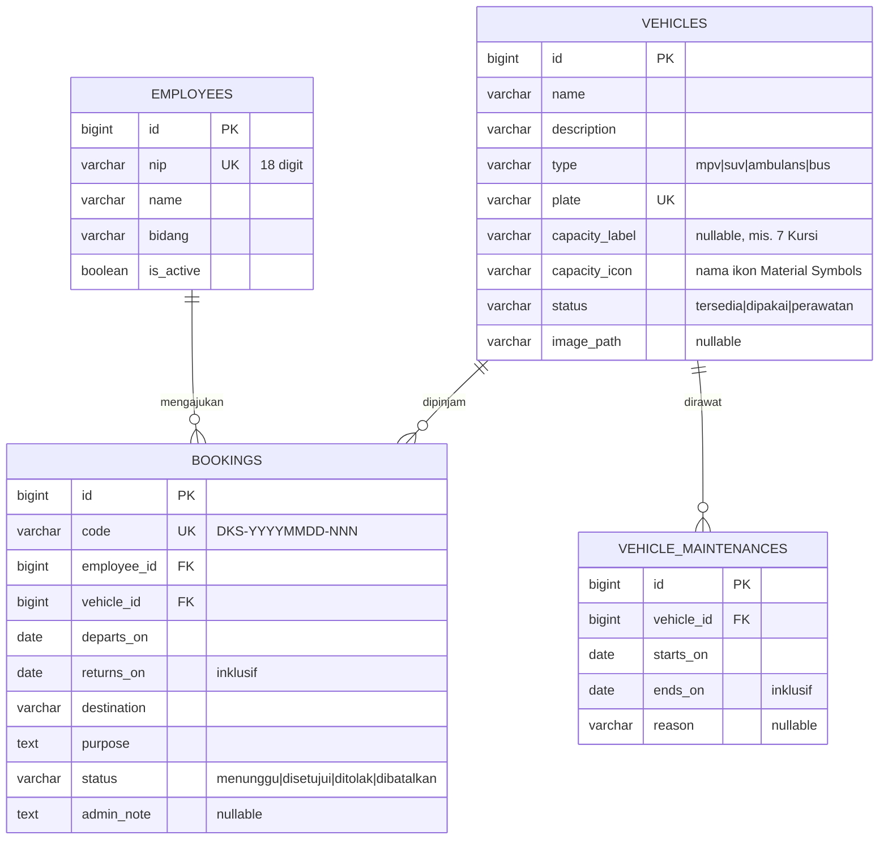

# Software Requirement Specification (SRS)

> Dokumen ini adalah sumber kebenaran (source of truth) untuk requirement proyek.
> Konteks bisnis digabung di sini (bukan BRD terpisah) sesuai default CLAUDE.md.
> Semua fase development harus bisa ditarik garis lurus ke dokumen ini.
>
> **Status: DRAFT v0.5 (2 Oktober 2026).** Bagian 1–5 disusun dari prototipe HTML dan desain Figma serta
> keputusan selama pengerjaan, bukan dari wawancara client. Butir bertanda **[Konfirmasi]** harus divalidasi
> sebelum dianggap final. Cakupan yang sudah dibangun: **role User (Pegawai)**. Role Admin sudah **direncanakan** (bagian 6.2) tetapi belum dibangun —
> spesifikasi desainnya sudah diarsipkan di `docs/DESIGN-ADMIN.md`.

---

## 1. Latar Belakang & Masalah Bisnis

Dinas Kesehatan PPKB Kabupaten Purbalingga memiliki armada kendaraan dinas (MPV, SUV, ambulans, bus puskesmas
keliling) yang dipakai bersama oleh banyak bidang. **[Konfirmasi]** Kondisi saat ini (As-Is) diasumsikan manual:
pengajuan lewat surat/chat, jadwal sulit dipantau, rawan bentrok. **Si Perkasa** (aplikasi peminjaman kendaraan dinas)
menggantikannya dengan pengajuan dan pemantauan jadwal online (To-Be).

## 2. Tujuan Proyek (Business Goals)

| ID | Tujuan | Ukuran keberhasilan |
|----|--------|---------------------|
| BG-01 | Jadwal & ketersediaan armada transparan bagi seluruh pegawai | **[Konfirmasi]** Pegawai bisa melihat ketersediaan tanpa bertanya ke admin |
| BG-02 | Pengajuan peminjaman terstandar dan hanya untuk pegawai terdaftar | **[Konfirmasi]** 100% pengajuan lewat sistem dengan NIP tervalidasi |
| BG-03 | Mencegah bentrok jadwal dan mempercepat persetujuan | **[Konfirmasi]** Tidak ada double booking; target waktu proses admin |
| BG-04 | Admin punya data penggunaan kendaraan untuk pelaporan | **[Konfirmasi]** Laporan bulanan tanpa rekap manual |

## 3. Scope

### In-Scope (iterasi ini — role User)
- Beranda, kalender ketersediaan, katalog armada, formulir peminjaman (verifikasi NIP, saran lokasi), konfirmasi,
  status pengajuan (daftar, pencarian, pagination) dan pembatalan.

### Out-of-Scope (iterasi ini)
- Role Admin termasuk **iterasi 2** (bagian 6.2), belum dibangun. Dari desain Figma, halaman berikut **tidak** termasuk iterasi 2
  kecuali dikonfirmasi: Laporan Operasional, Profil & Pengaturan Akun Admin, Tambah Jadwal Baru, Riwayat Peminjaman terpisah,
  serta bagian "Administrasi & Pajak" pada data kendaraan (sengaja dihilangkan atas permintaan user).
- Notifikasi (WhatsApp/email), login berbasis akun/password untuk pegawai, integrasi dengan sistem kepegawaian.
- Daftar hari libur nasional, jam tutup pengajuan, pengecualian pengajuan mendadak (mis. ambulans), pemakaian
  setengah hari — lihat bagian 11 (pertanyaan terbuka).
- Filter katalog berdasarkan tipe/status (sengaja dikeluarkan, lihat bagian 10).

## 4. Stakeholder & Peran Pengguna

| Role | Deskripsi | Hak Akses Utama |
|------|-----------|------------------|
| Pegawai (User) | Staf Dinkes PPKB yang meminjam kendaraan | Lihat jadwal & katalog, ajukan peminjaman, lihat/cari/batalkan pengajuan miliknya |
| Admin / Pengelola | Pengelola armada & logistik | Verifikasi (setujui/tolak) peminjaman, kelola kendaraan, pegawai, dan akun admin lain *(direncanakan, belum dibangun)* |

## 5. Batasan (Constraints)

- **Budget / Waktu:** **[Konfirmasi]**
- **Tech Stack:** Laravel 12 (PHP 8.2), Blade, Tailwind CSS v4 (Vite), MySQL/MariaDB (XAMPP lokal), Pest untuk test,
  Laravel Pint untuk format kode. Ikon Material Symbols dan font Inter dimuat dari Google Fonts (butuh internet).
  *(Catatan: versi awal dokumen menyebut Next.js — itu sisa template dan sudah diganti sesuai keputusan proyek.)*
- Arsitektur monolith sederhana, tanpa API terpisah — sesuai skala SME/instansi.
- Ekstensi `pdo_sqlite` tidak tersedia di PHP XAMPP lingkungan ini, karena itu database dev dan test memakai MySQL.

---

## 6. Functional Requirements (FR)

Rincian per ID, prioritas, status, dan test case ada di `docs/RTM.md`.

| ID | Requirement | Modul | Prioritas |
|----|-------------|-------|-----------|
| FR-U01 | **Beranda:** hero, alur peminjaman 3 langkah, kalender ketersediaan, pratinjau 3 kendaraan. Menu navigasi: Beranda · Katalog Mobil · Status Peminjaman · Kontak. Footer berisi Tentang, Kontak Kami, dan Jam Layanan | Beranda | Tinggi |
| FR-U02 | **Kalender:** per hari menampilkan jumlah kendaraan **Dipesan** dan **Perawatan** (hari kosong tanpa penanda). Klik tanggal berpenanda membuka modal "Detail Jadwal Armada" berisi pengajuan *Menunggu/Disetujui* dan jadwal perawatan hari itu — isinya selalu sama dengan yang dihitung chip. NIP pemohon disamarkan | Kalender | Tinggi |
| FR-U03 | **Katalog:** seluruh kendaraan, 4 kartu per baris, 8 per halaman dengan pager angka. Kartu: foto, badge status (kiri atas), label kapasitas (kiri bawah foto, bila ada), nama, deskripsi singkat, tombol "Pilih Kendaraan" (nonaktif bila tidak tersedia) | Katalog | Tinggi |
| FR-U04 | **Verifikasi NIP:** 18 digit, dicocokkan dengan data pegawai **aktif** (langkah 1 formulir) | Formulir | Tinggi |
| FR-U05 | **Formulir 3 langkah** (Detail Peminjam → Jadwal & Tujuan → Konfirmasi), validasi di browser dan server. Jadwal diisi **per tanggal tanpa jam** (Tanggal Keberangkatan, Tanggal Kembali — tanggal kembali tidak boleh sebelum tanggal berangkat). Lokasi Tujuan memberi saran tempat dari OpenStreetMap sambil mengetik; teks bebas tetap diterima. Ringkasan di langkah 3 memuat Nama Pegawai, NIP, Kendaraan, Jadwal, Tujuan, Keperluan. Tidak ada kotak persetujuan | Formulir | Tinggi |
| FR-U06 | **Aturan penolakan:** kendaraan tidak berstatus *Tersedia*; jadwal bentrok dengan pengajuan *Menunggu/Disetujui* atau jadwal perawatan; atau melanggar lead time (BR-02) | Formulir | Tinggi |
| FR-U07 | **Konfirmasi:** Booking ID `#BRV-YYYYMMDD-NNN`, status, identitas pemohon, kendaraan, waktu peminjaman, tombol ke Status dan Beranda. Layout ringkas (muat satu layar). Hanya pemilik yang dapat membuka | Konfirmasi | Sedang |
| FR-U08 | **Status Peminjaman:** pegawai memasukkan NIP, lalu melihat daftar pengajuan miliknya (status, kode, tanggal diajukan, kendaraan, pemohon [nama + NIP], tujuan, jadwal, catatan admin). Tanpa kartu statistik | Status | Tinggi |
| FR-U09 | **Pembatalan:** pengajuan berstatus *Menunggu* dapat dibatalkan pemiliknya lewat dialog konfirmasi | Status | Sedang |
| FR-U10 | **Pencarian pengajuan:** kolom pencarian di halaman Status mencari NIP, nama pemohon, nama kendaraan, kode booking, dan tujuan; berjalan di server atas **semua halaman**; semua kata harus cocok (urutan bebas) | Status | Sedang |
| FR-U11 | **Pagination Status:** 5 pengajuan per halaman, terbaru lebih dulu, pager angka, teks "Menampilkan X–Y dari N", pencarian ikut terbawa antarhalaman | Status | Sedang |

### 6.2 Role Admin — direncanakan (iterasi 2, belum dibangun)

Daftar halaman ditetapkan user; tampilan mengikuti Figma "DINKES FIX" (frame admin) **setelah Figma dapat dibaca**. Status semua baris:
*Not Started*.

| ID | Requirement | Halaman | Prioritas |
|----|-------------|---------|-----------|
| FR-A01 | **Masuk admin:** login dengan akun admin; semua halaman admin hanya untuk admin yang masuk. Kebijakan pendaftaran admin **[Konfirmasi]** (bagian 11) | Masuk Admin | Tinggi |
| FR-A02 | **Beranda Admin:** (a) grafik kendaraan yang paling sering digunakan; (b) daftar kendaraan yang digunakan **pada hari ini**. Periode grafik dan definisi "digunakan" **[Konfirmasi]** | Beranda Admin | Tinggi |
| FR-A03 | **Manajemen Kendaraan:** daftar, tambah, ubah, (nonaktifkan/hapus) kendaraan: nama, deskripsi, tipe, plat, kapasitas, status, foto. **Tanpa bagian "Administrasi & Pajak"** (STNK, pajak, dsb.) di daftar, detail, maupun form Tambah Kendaraan Baru | Manajemen Kendaraan, Tambah Kendaraan Baru, Detail & Edit Kendaraan | Tinggi |
| FR-A04 | **Verifikasi Peminjaman:** daftar pengajuan (terutama *Menunggu*); setujui atau tolak dengan catatan (`admin_note`, tampil ke pemohon di halaman Status dan kalender). Pengajuan yang sudah diproses tetap tercatat sebagai riwayat | Verifikasi Peminjaman | Tinggi |
| FR-A05 | **Manajemen Pegawai:** daftar, tambah, ubah, aktif/nonaktifkan data pegawai (NIP 18 digit, nama, bidang) — dasar verifikasi NIP di formulir peminjaman | Manajemen Pegawai, Detail & Edit Data Pegawai | Tinggi |
| FR-A06 | **Manajemen Admin:** daftar, tambah, ubah, nonaktifkan akun admin; admin tidak dapat menonaktifkan dirinya sendiri atau admin terakhir | Manajemen Admin | Tinggi |

Catatan keterkaitan dengan role User yang sudah ada: kolom `bookings.admin_note`, status `disetujui/ditolak`, tabel
`vehicle_maintenances`, dan `employees.is_active` sudah tersedia; FR-A04 dan FR-A05 mengisi data yang saat ini hanya bisa
diubah lewat database/seeder.

## 7. Non-Functional Requirements (NFR)

| ID | Requirement | Kategori | Target |
|----|-------------|----------|--------|
| NFR-001 | Percobaan verifikasi NIP dan masuk ke halaman Status dibatasi 10x/menit per IP (cegah enumerasi NIP) | Keamanan | Diterapkan |
| NFR-002 | Teks dari pengguna di-escape saat ditampilkan; NIP disamarkan di kalender publik; kata pencarian diperlakukan sebagai teks biasa (karakter `%`, `_`, `\` bukan wildcard) | Keamanan / Privasi | Diterapkan |
| NFR-003 | Pengecekan bentrok jadwal atomik (baris kendaraan dikunci dalam transaksi) | Integritas data | Diterapkan |
| NFR-004 | Tampilan responsif (ponsel ≥ 360px sampai desktop 1280px) | Kompatibilitas | Diterapkan *(verifikasi visual ponsel belum dilakukan)* |
| NFR-005 | **[Konfirmasi]** Pegawai dikenali hanya dari NIP (tanpa password). NIP bukan rahasia — risiko orang lain melihat/membatalkan pengajuan dengan NIP temannya | Keamanan | Risiko diterima sementara; solusi: login/OTP di fase berikutnya |
| NFR-006 | **[Konfirmasi]** Estimasi pengguna bersamaan, target uptime, hosting | Skalabilitas | Belum ditentukan |
| NFR-007 | Saran lokasi memakai server Photon publik (gratis, tanpa SLA, batas pemakaian wajar). Mitigasi: pencarian lewat server kita (IP pegawai tidak terkirim ke pihak luar), hasil di-cache 24 jam, endpoint dibatasi 60/menit, gagal-aman (daftar kosong, form tetap bisa diisi). Atribusi "© OpenStreetMap contributors" ditampilkan. Untuk beban berat ganti `GEOCODER_URL` ke server sendiri/berbayar | Ketergantungan pihak ketiga | Diterapkan |
| NFR-008 | Kualitas kode: seluruh perilaku di atas dicakup test otomatis (Pest) dan kode diformat dengan Laravel Pint | Maintainability | 105 test lulus |

---

## 8. Aturan Bisnis (Business Rules)

| ID | Aturan |
|----|--------|
| BR-01 | Hanya pegawai **aktif** dengan NIP 18 digit yang terdaftar yang dapat mengajukan; status aktif dicek ulang saat form dikirim. |
| BR-02 | **Lead time:** pengajuan paling lambat 1 hari kerja (Senin–Jumat) sebelum tanggal berangkat; hari H tidak dapat diajukan. Pemakaian di Sabtu/Minggu/hari libur tetap boleh. Mengajukan Senin–Kamis → paling cepat berangkat besok; Jumat → Sabtu; Sabtu/Minggu → Selasa. Hari libur nasional belum dihitung. Logika: `app/Services/BookingWindow.php`. |
| BR-03 | **Pemakaian per hari penuh** (tanpa jam). Kendaraan terkunci dari tanggal berangkat sampai tanggal kembali, keduanya termasuk. Perjalanan sehari: tanggal kembali = tanggal berangkat. |
| BR-04 | Pengajuan berstatus *Menunggu* dan *Disetujui* menahan kendaraan; *Ditolak* dan *Dibatalkan* melepasnya. Dua pengajuan tidak boleh berbagi satu hari untuk kendaraan yang sama. |
| BR-05 | Kendaraan hanya dapat diajukan bila berstatus *Tersedia* dan tidak punya jadwal perawatan (`vehicle_maintenances`) yang beririsan dengan tanggal pemakaian. |
| BR-06 | Kode booking `DKS-YYYYMMDD-NNN` (tanggal = tanggal pengajuan, nomor urut per hari, mulai 001). Booking ID tampilan `#BRV-YYYYMMDD-NNN`. |
| BR-07 | Pembatalan hanya oleh pemilik dan hanya untuk status *Menunggu*; hasilnya status *Dibatalkan* (data tidak dihapus). |
| BR-08 | Halaman konfirmasi dan Status hanya menampilkan pengajuan milik pegawai yang NIP-nya terverifikasi di sesi browser tersebut. |
| BR-09 | Kalender: chip **Dipesan** = jumlah kendaraan berbeda yang ditahan (Menunggu + Disetujui) pada hari itu; chip **Perawatan** = jumlah kendaraan dalam perawatan pada hari itu. Hari tanpa keduanya tanpa penanda. |
| BR-10 | Pencarian Status: semua kata harus cocok di salah satu dari kode booking, tujuan, nama kendaraan. Kata dianggap menyebut pemohon bila berupa nomor ≥ 6 digit yang ada di NIP-nya, atau kata ≥ 3 huruf yang ada di namanya (potongan pendek seperti "001" tidak boleh membuat semua pengajuan cocok). |
| BR-11 | Saran lokasi: aktif mulai 3 huruf, hasil dibatasi Indonesia dan diprioritaskan sekitar Purbalingga, maksimal 6 saran tanpa duplikat, di-cache 24 jam. |
| BR-12 | Pagination: Katalog 8 per halaman; Status 5 per halaman (terbaru dulu). Halaman di luar jangkauan dialihkan ke halaman 1. |

## 9. Model Data & Peta Halaman

### 9.1 ERD

Indeks: `bookings(vehicle_id, departs_on, returns_on)` untuk pengecekan bentrok dan kalender;
`bookings(employee_id, status)` untuk halaman Status; `vehicle_maintenances(vehicle_id, starts_on, ends_on)`.
Tabel `users`, `sessions`, `cache`, `jobs` adalah bawaan Laravel (`users` disiapkan untuk login Admin).

### 9.2 Peta halaman dan rute

| Halaman | Metode & URL | Catatan |
|---------|--------------|---------|
| Beranda | `GET /` | |
| Katalog | `GET /katalog` | `?page=` |
| Kalender (data bulan) | `GET /kalender?month=YYYY-MM` | JSON jumlah dipesan/perawatan per hari |
| Kalender (detail hari) | `GET /kalender/detail?date=YYYY-MM-DD` | Potongan HTML untuk modal |
| Saran lokasi | `GET /lokasi/cari?q=` | JSON, throttle 60/menit |
| Formulir | `GET /peminjaman/buat?vehicle={id}` | |
| Verifikasi NIP | `POST /peminjaman/verifikasi-nip` | JSON, throttle 10/menit |
| Kirim pengajuan | `POST /peminjaman` | |
| Konfirmasi | `GET /peminjaman/{kode}/berhasil` | Hanya pemilik (403 untuk lainnya) |
| Batalkan | `DELETE /peminjaman/{kode}` | Hanya pemilik, status Menunggu |
| Status | `GET /status?q=&page=` | |
| Masuk / keluar Status | `POST /status/masuk` (throttle 10/menit), `POST /status/keluar` | |

## 10. Keputusan Desain & Deviasi dari Figma

Desain acuan: Figma "DINKES FIX". Hal yang **sengaja berbeda** dari Figma atas keputusan user:

| Bagian | Keputusan |
|--------|-----------|
| Katalog | Panel filter Tipe dan Status dihapus; 4 kartu per baris (Figma: 3); desain kartu mengikuti gambar referensi user |
| Kartu kendaraan | Hanya foto, nama, deskripsi, kapasitas; spesifikasi (transmisi, bahan bakar, dsb.) dihapus |
| Beranda | Baris statistik armada dihapus; kalender menampilkan Dipesan/Perawatan (tanpa "Tersedia") dengan modal detail, bukan panel di bawah kalender |
| Footer | "Tautan Cepat" dihapus; Kontak Kami di tengah; ditambah Jam Layanan |
| Formulir | Kotak persetujuan dan teks "Tip" dihapus; label "Tanggal" (bukan "Waktu"); stepper berujung di lingkaran |
| Konfirmasi | Kartu "Butuh Bantuan Cepat" dan "Panduan Penggunaan" dihapus |
| Status | Kartu statistik dihapus; pencarian dan pagination ditambahkan |

Frame **Status Peminjaman** dan **Footer** awalnya dibangun dari prototipe HTML `index (1).html` karena API Figma terkena rate limit; sejak desain
diarsipkan (2 Okt 2026) keduanya sudah dibandingkan dengan data Figma — hasilnya di `docs/DESIGN-USER.md` bagian 3.6 dan 3.7
(selisih yang belum diputuskan: ikon TikTok di footer, baris Bidang dan NIP hijau di kartu Status).

**Arsip desain lengkap** (design system, semua frame admin dan user, pratinjau, teks, data mentah, skrip) ada di `docs/DESIGN.md`,
`docs/DESIGN-ADMIN.md`, `docs/DESIGN-USER.md` dan `docs/design/`, sehingga pekerjaan UI tidak lagi bergantung pada akses Figma.

## 11. Pertanyaan Terbuka [Konfirmasi]

| # | Pertanyaan | Dampak |
|---|------------|--------|
| 1 | **Jam Layanan** di footer (Senin–Kamis 07.30–16.00, Jumat 07.30–16.30) adalah asumsi jam kerja instansi pemerintah, bukan data resmi Dinkes | Teks footer |
| 2 | Hari libur nasional: perlu tabel libur agar lead time (BR-02) akurat | BR-02 |
| 3 | Jam tutup pengajuan pada hari kerja terakhir (mis. 15.00)? Saat ini sampai 23.59 | BR-02 |
| 4 | Pengecualian pengajuan mendadak untuk ambulans/keperluan darurat? | BR-02 |
| 5 | Apakah pemakaian **setengah hari** perlu didukung (mis. Pagi/Siang/Seharian)? Saat ini satu kendaraan terkunci seharian | BR-03/04 |
| 6 | Apakah pengajuan **Menunggu** boleh tampil nama pemohonnya di kalender publik, atau hanya yang Disetujui? | FR-U02 |
| 7 | Pegawai hanya dikenali dari NIP — perlu login/OTP? (NFR-005) | Keamanan |
| 8 | Budget, deadline, hosting, jumlah pengguna bersamaan, target uptime | Bagian 5, NFR-006 |
| 9 | Daftar tujuan baku (puskesmas, RS, kantor dinas) agar nama tujuan seragam dan bisa dilaporkan; data OpenStreetMap tidak lengkap untuk beberapa puskesmas | FR-U05, laporan Admin |

| 10 | **Kebijakan pendaftaran admin.** Figma punya halaman "Daftar Admin", sedangkan daftar user memuat "Manajemen Admin" (admin membuat admin). Pendaftaran terbuka bebas berarti siapa pun bisa menjadi admin. Usulan: tanpa pendaftaran publik (akun dibuat lewat Manajemen Admin; admin pertama lewat seeder/artisan) | FR-A01, FR-A06 |
| 11 | **Jadwal perawatan kendaraan** (tabel `vehicle_maintenances`, tampil di kalender) belum punya halaman pengisian di daftar user. Masuk ke Manajemen Kendaraan? | FR-A03 |
| 12 | **Beranda Admin:** periode grafik "kendaraan paling sering digunakan" (30 hari / bulan ini / 12 bulan?) dan apakah hanya pengajuan *Disetujui* yang dihitung; "digunakan hari ini" = pengajuan *Disetujui* yang mencakup tanggal hari ini? | FR-A02 |
| 13 | **Penghapusan kendaraan/pegawai** yang sudah punya riwayat pengajuan: nonaktifkan saja (usulan), atau boleh dihapus? | FR-A03, FR-A05 |
| 14 | ~~Peran admin berbeda?~~ **Diputuskan (2 Okt 2026): semua admin setara**, tidak ada super admin. Perlindungan: tidak bisa menonaktifkan/menghapus diri sendiri atau admin aktif terakhir | FR-A06 |
| 16 | **Reset kata sandi admin:** Figma menunjukkan reset **manual** (modal "Hubungi Administrator" berisi kontak admin utama), bukan reset email otomatis. Setuju? Siapa/ kontak mana yang ditampilkan? | FR-A01 |
| 17 | **Field data kendaraan dan pegawai dari Figma** yang belum ada di database (tahun, bahan bakar, odometer, warna, merk/model, foto 4 sisi; email, pangkat, jabatan, status verifikasi) — mana yang dibuat? Daftar lengkap: `docs/DESIGN-ADMIN.md` bagian 5, pertanyaan desain #3–#12 di bagian 7 dokumen itu | FR-A03, FR-A05 |
| 15 | Notifikasi ke pemohon saat pengajuan disetujui/ditolak (WhatsApp/email) — masih di luar scope; pemohon baru tahu lewat halaman Status | FR-A04 |

---

## Riwayat Revisi

| Versi | Tanggal | Perubahan |
|-------|---------|-----------|
| 0.1 | 2 Okt 2026 | Draf awal dari prototipe HTML dan Figma; role User |
| 0.2 | 2 Okt 2026 | Kalender Dipesan/Perawatan, lead time hari kerja, jadwal per tanggal, saran lokasi OSM |
| 0.3 | 2 Okt 2026 | Pagination dan pencarian server-side halaman Status; aturan bisnis, ERD, peta rute, deviasi Figma, pertanyaan terbuka; penyesuaian UI (footer, katalog, konfirmasi, formulir) |

| 0.5 | 2 Okt 2026 | Desain Figma diarsipkan (24 frame): `DESIGN.md`, `DESIGN-ADMIN.md`, `DESIGN-USER.md`, `design/`. Temuan: Manajemen Admin tidak punya frame; reset kata sandi manual lewat modal "Hubungi Administrator"; model data Figma jauh lebih kaya dari tabel sekarang (lihat DESIGN-ADMIN bagian 5) |
| 0.4 | 2 Okt 2026 | Merencanakan role Admin (FR-A01–A06) berdasarkan daftar halaman dari user; pertanyaan terbuka #10–#15. Belum ada kode admin |
| 0.6 | 2 Okt 2026 | Role Admin (FR-A01–A06) dibangun sesuai keputusan user (docs/DESIGN-ADMIN.md bagian 8): login NIP, tanpa pendaftaran, kategori kendaraan, Selesai diturunkan otomatis, alasan penolakan wajib. Rebrand menjadi **Si Perkasa** |
| 0.7 | 2 Okt 2026 | Keputusan: semua admin setara (#14). Polish responsif panel admin: tabel pegawai/admin menjadi kartu di layar kecil |

*Update dokumen ini setiap ada perubahan scope atau requirement baru. Setiap FR/NFR baru wajib disinkronkan ke `docs/RTM.md`.*
